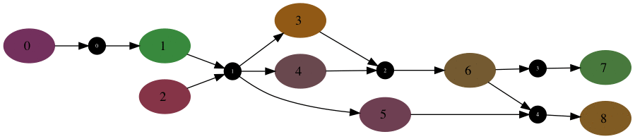

# Graphical Generative Models

This is a Python library that extends traditional generative time series models, such as hidden markov models, linear dynamical systems and their extensions, to graphical models.

With this framework, a user can do Bayesian inference over graphical structures.  One use case is doing inference over a [pedigree chart](https://en.wikipedia.org/wiki/Genogram), where phenotypes (observations) are produced through some generative process that is a function of the person's genotype (latent state) and the genotypes of individuals are linked through their ancestor tree.

This library extends previous graphical generative model techniques by adding support for hypergraphs (to incorporate ordering constraints on parents) and provides an efficient way to deal with directed cycles (for efficient message passing that is independent of the cycle's diameter).

